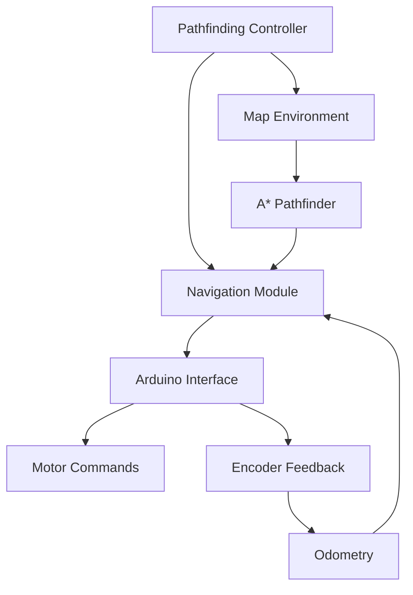

# DriveSync - Intelligent Differential Drive Robot System

[](https://python.org)
[](https://arduino.cc)
[](https://ros.org)
[](LICENSE)

A comprehensive differential drive robot system featuring autonomous navigation, pathfinding, and distributed communication capabilities.

## 🚀 Features

### 🤖 Robot Control Systems
- **Standalone Pathfinding**: Direct Arduino control with A* pathfinding
- **ROS2 Distributed System**: Multi-node architecture with advanced features
- **Human-like Navigation**: Intuitive "look-turn-drive" control logic
- **Real-time Visualization**: Interactive Pygame interface

### 🧭 Navigation Capabilities
- **A* Pathfinding**: Optimal route planning with obstacle avoidance
- **Angular Constraints**: 90°, 45°, 180°, 360° turn planning
- **Junction-aware Navigation**: Smart intersection handling
- **Manual Override**: Real-time keyboard control

### 🔧 Hardware Integration
- **Optimized Arduino Firmware**: High-frequency encoder reading with interrupts
- **Differential Drive Control**: Precise motor speed control with L298N drivers
- **Quadrature Encoders**: Accurate odometry and position tracking
- **Serial Communication**: Robust Arduino-Python interface

## 📁 Project Structure

```
DriveSync/
├── robot_control/          # Standalone pathfinding system
│   ├── pathfinding_robot_controller.py    # Main pathfinding application
│   ├── smooth_robot_controller.py         # Direct robot control interface
│   ├── modules/                           # Core navigation modules
│   │   ├── navigation.py                  # Human-like navigation logic
│   │   ├── pathfinding.py                 # A* algorithm implementation
│   │   └── map_environment.py             # Road network and obstacles
│   ├── firmware/                          # Arduino firmware
│   │   └── OptimizedArduinoFirmware/      # High-performance encoder firmware
│   ├── debug_scripts/                     # Hardware testing utilities
│   ├── tests/                            # Test files
│   └── docs/                             # Documentation
├── V2V-main/               # ROS2 distributed system
│   └── differential_drive_robot/         # ROS2 packages
└── build/                  # Build artifacts
```

## 🎮 Quick Start

### Prerequisites
```bash
# Python dependencies
pip install pygame pyserial

# Hardware requirements
- Arduino Uno/Nano
- L298N Motor Driver
- 2x DC Motors with Quadrature Encoders
- Differential drive chassis
```

### Standalone Pathfinding System
```bash
cd robot_control
python3 pathfinding_robot_controller.py
```

**Controls:**
- **Left-click**: Set navigation target
- **W/A/S/D**: Manual control override
- **ESC**: Exit application

### Direct Robot Control
```bash
cd robot_control  
python3 smooth_robot_controller.py
```

## 🧠 Navigation System

### Human-like Control Logic
The robot uses intuitive navigation inspired by human driving:

1. **Look**: Identify target waypoint
2. **Turn**: Rotate to face target (if needed)
3. **Drive**: Move straight toward target
4. **Repeat**: Continue until goal reached

```python
if not_facing_target():
    turn_towards_target()
else:
    drive_straight_to_target()
```

### Key Features
- **11° turn threshold**: Prevents jittering
- **Equal motor speeds**: Ensures straight-line movement
- **Distance-based speed**: Automatic slowdown near targets
- **Junction-free boundaries**: Smooth intersection navigation

## 🛠️ Hardware Configuration

### Arduino Firmware Features
- **115200 baud** serial communication
- **Pin Change Interrupts** for both encoders
- **50Hz encoder data** transmission
- **Quadrature decoding** with lookup tables
- **Motor enable/disable** control

### Wiring Diagram
```
Arduino -> L298N Motor Driver
D5  -> ENA (Left Motor Enable)
D6  -> ENB (Right Motor Enable)  
D7  -> IN1 (Left Motor Direction)
D8  -> IN2 (Left Motor Direction)
D9  -> IN3 (Right Motor Direction)
D10 -> IN4 (Right Motor Direction)

Arduino -> Encoders
D2  -> Left Encoder A (Interrupt)
D3  -> Left Encoder B
A4  -> Right Encoder A (Pin Change Interrupt)
A5  -> Right Encoder B
```

## 📊 System Architecture

### Standalone System (robot_control/)


### ROS2 System (V2V-main/)
- **Multi-node architecture**
- **Distributed processing**
- **Advanced sensor integration**
- **Inter-robot communication**

## 🔧 Development

### Adding New Features
1. **Navigation**: Modify `modules/navigation.py`
2. **Pathfinding**: Extend `modules/pathfinding.py`
3. **Map Layout**: Update `modules/map_environment.py`
4. **Hardware**: Edit firmware in `firmware/OptimizedArduinoFirmware/`

### Testing
```bash
# Run hardware tests
cd robot_control/debug_scripts
python3 simple_motor_test.py
python3 test_corrected_encoders.py

# Test pathfinding algorithms
cd robot_control/tests
python3 test_pathfinding.py
```

## 📈 Performance Metrics

- **Pathfinding**: A* with heuristic optimization
- **Navigation Update**: 20Hz control loop
- **Encoder Resolution**: ~0.03mm per tick
- **Turn Accuracy**: ±5 degrees
- **Position Accuracy**: ±2cm over 5m distance

## 🤝 Contributing

1. Fork the repository
2. Create a feature branch (`git checkout -b feature/AmazingFeature`)
3. Commit your changes (`git commit -m 'Add AmazingFeature'`)
4. Push to the branch (`git push origin feature/AmazingFeature`)
5. Open a Pull Request

## 📝 License

This project is licensed under the MIT License - see the [LICENSE](LICENSE) file for details.

## 🙏 Acknowledgments

- **Pygame Community** for visualization framework
- **Arduino Community** for firmware optimization techniques
- **ROS2 Community** for distributed robotics architecture
- **A* Algorithm** pioneers for pathfinding foundation

## 📞 Support

For questions, issues, or contributions:
- **Issues**: GitHub Issues page
- **Discussions**: GitHub Discussions
- **Documentation**: See `docs/` directory in each module

---

**Built with ❤️ for autonomous robotics and intelligent navigation**
