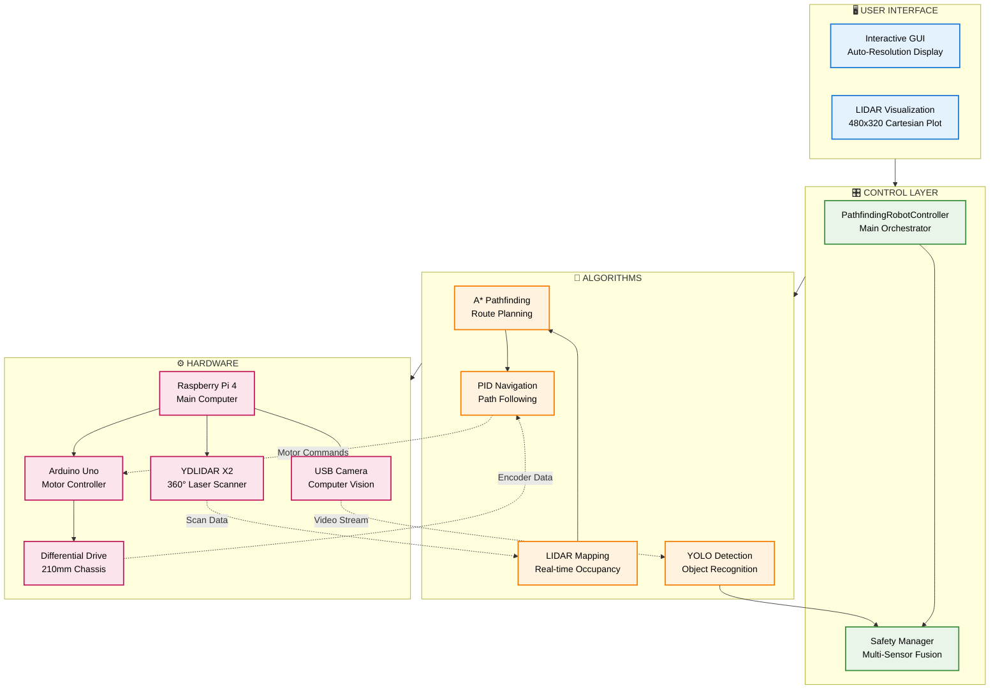
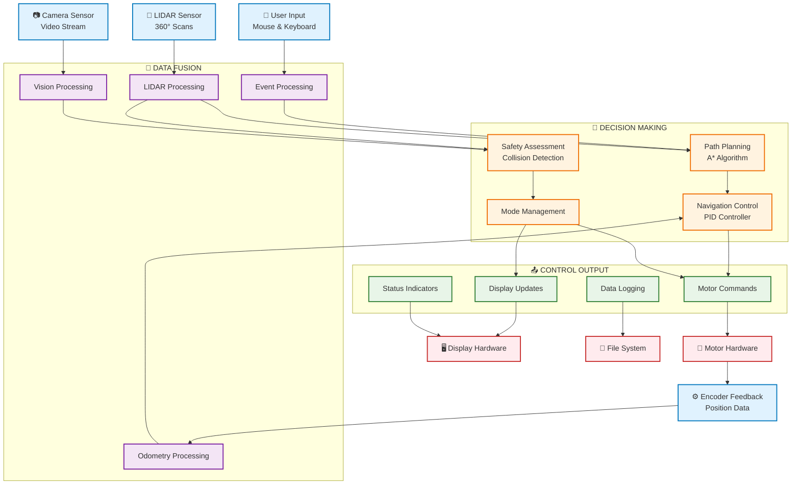
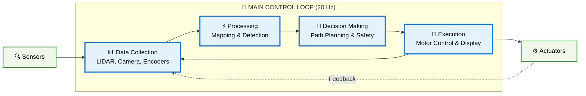

# Clean Mermaid Diagrams - Copy Only the Code Blocks

## 1. Simple System Architecture (Recommended)



## 2. Data Flow Diagram



## 3. Control Loop (Simplified)



## Instructions:

1. **Copy ONLY the code between** ```mermaid and ```
2. **Don't include** the markdown headers (# titles)
3. **Don't include** the ```mermaid and ``` markers
4. **Paste directly** into Mermaid Live Editor
5. **Use Diagram #1** for your presentation - it's the clearest and most comprehensive
