# 🤖 System Architecture - Crisp Mermaid Diagram

## Clean & Clear System Architecture

```mermaid
graph TB
    %% User Interface Layer
    subgraph UI ["🖥️ USER INTERFACE"]
        GUI[Interactive GUI<br/>Auto-Resolution Display]
        LIDAR_VIZ[LIDAR Visualization<br/>480x320 Cartesian Plot]
    end

    %% Control Layer
    subgraph CTRL ["🎛️ CONTROL LAYER"]
        MAIN[PathfindingRobotController<br/>Main Orchestrator]
        SAFETY[Safety Manager<br/>Multi-Sensor Fusion]
    end

    %% Algorithm Layer
    subgraph ALGO ["🧠 ALGORITHMS"]
        PATHFIND[A* Pathfinding<br/>Route Planning]
        NAV[PID Navigation<br/>Path Following]
        LIDAR_MAP[LIDAR Mapping<br/>Real-time Occupancy]
        VISION[YOLO Detection<br/>Object Recognition]
    end

    %% Hardware Layer
    subgraph HW ["⚙️ HARDWARE"]
        RPI[Raspberry Pi 4<br/>Main Computer]
        LIDAR[YDLIDAR X2<br/>360° Laser Scanner]
        CAMERA[USB Camera<br/>Computer Vision]
        ARDUINO[Arduino Uno<br/>Motor Controller]
        ROBOT[Differential Drive<br/>210mm Chassis]
    end

    %% Connections
    UI --> CTRL
    CTRL --> ALGO
    ALGO --> HW

    %% Internal connections
    MAIN --> SAFETY
    PATHFIND --> NAV
    LIDAR_MAP --> PATHFIND
    VISION --> SAFETY
    
    RPI --> ARDUINO
    RPI --> LIDAR
    RPI --> CAMERA
    ARDUINO --> ROBOT

    %% Data flow annotations
    LIDAR -.->|Scan Data| LIDAR_MAP
    CAMERA -.->|Video Stream| VISION
    ROBOT -.->|Encoder Data| NAV
    NAV -.->|Motor Commands| ARDUINO

    %% Styling
    classDef uiStyle fill:#e3f2fd,stroke:#1976d2,stroke-width:2px,color:#000
    classDef ctrlStyle fill:#e8f5e8,stroke:#388e3c,stroke-width:2px,color:#000
    classDef algoStyle fill:#fff3e0,stroke:#f57c00,stroke-width:2px,color:#000
    classDef hwStyle fill:#fce4ec,stroke:#c2185b,stroke-width:2px,color:#000

    class GUI,LIDAR_VIZ uiStyle
    class MAIN,SAFETY ctrlStyle
    class PATHFIND,NAV,LIDAR_MAP,VISION algoStyle
    class RPI,LIDAR,CAMERA,ARDUINO,ROBOT hwStyle
```

## Key System Specifications

### 🔧 **Technical Specs**
- **Navigation**: A* algorithm with ±3cm accuracy
- **Mapping**: Real-time LIDAR occupancy grid (5cm resolution)
- **Safety**: Multi-sensor fusion with <80ms emergency response
- **Communication**: Dual USB serial (115200 baud)
- **Performance**: 20Hz control loop, 60 FPS GUI

### 📡 **Hardware Configuration**
- **Main**: Raspberry Pi 4 (Linux, Python 3.11)
- **LIDAR**: YDLIDAR X2 (/dev/ttyUSB1, 8m range)
- **Vision**: USB Camera (YOLO object detection)
- **Control**: Arduino Uno (/dev/ttyUSB0, motor driver)
- **Robot**: Differential drive (4993/4966 encoder ticks/rev)

### 🎯 **Key Features**
- **Autonomous Navigation** with real-time obstacle avoidance
- **Interactive GUI** with live mapping visualization  
- **Safety-First Design** with redundant collision detection
- **Modular Architecture** enabling easy system expansion
