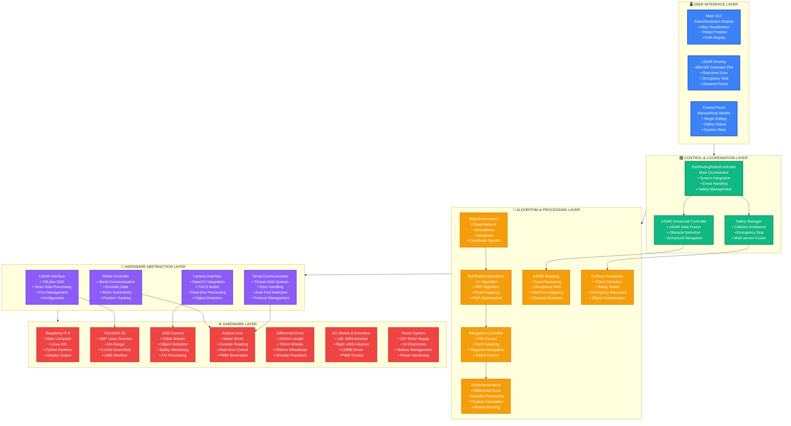
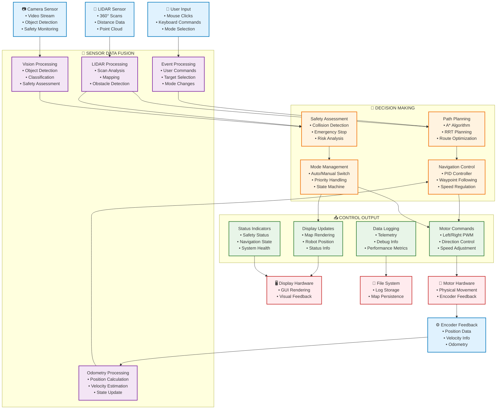
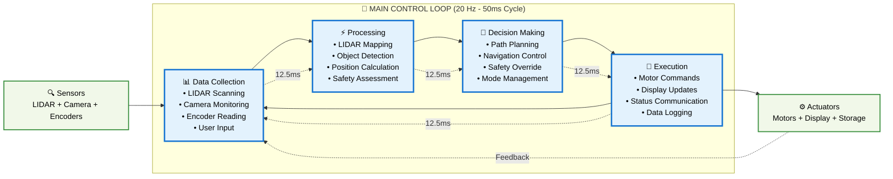
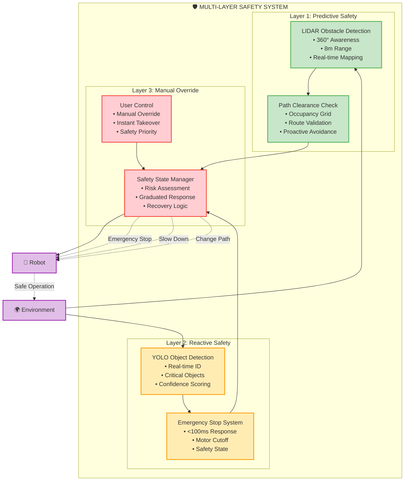
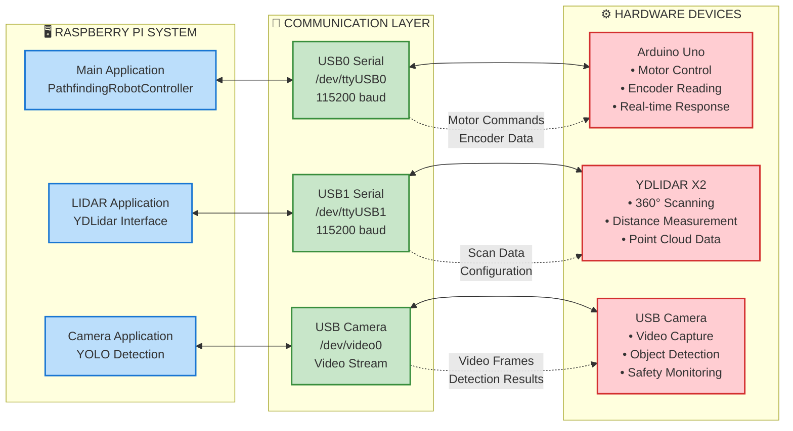

# 🤖 Robot Control System - Mermaid Diagrams

## System Architecture Diagram

```mermaid
graph TB
    %% User Interface Layer
    subgraph UI ["🖥️ USER INTERFACE LAYER"]
        GUI[Main GUI<br/>Auto-Resolution Display<br/>• Map Visualization<br/>• Robot Position<br/>• Path Display]
        LIDAR_UI[LIDAR Overlay<br/>480x320 Cartesian Plot<br/>• Real-time Scan<br/>• Occupancy Grid<br/>• Obstacle Points]
        CONTROL[Control Panel<br/>Manual/Auto Modes<br/>• Target Setting<br/>• Safety Status<br/>• System Stats]
    end

    %% Control & Coordination Layer
    subgraph COORD ["🎛️ CONTROL & COORDINATION LAYER"]
        MAIN[PathfindingRobotController<br/>Main Orchestrator<br/>• System Integration<br/>• Event Handling<br/>• Safety Management]
        LIDAR_ENH[LIDAR Enhanced Controller<br/>• LIDAR Data Fusion<br/>• Obstacle Detection<br/>• Enhanced Navigation]
        SAFETY_MGR[Safety Manager<br/>• Collision Avoidance<br/>• Emergency Stop<br/>• Multi-sensor Fusion]
    end

    %% Algorithm & Processing Layer
    subgraph ALGO ["🧠 ALGORITHM & PROCESSING LAYER"]
        MAP_ENV[Map Environment<br/>• Road Network<br/>• Boundaries<br/>• Obstacles<br/>• Coordinate System]
        PATHFIND[Pathfinding Algorithms<br/>• A* Algorithm<br/>• RRT Algorithm<br/>• Road Snapping<br/>• Path Optimization]
        NAV_CTRL[Navigation Controller<br/>• PID Control<br/>• Path Following<br/>• Waypoint Navigation<br/>• Speed Control]
        LIDAR_MAP[LIDAR Mapping<br/>• Scan Processing<br/>• Occupancy Grid<br/>• Real-time Mapping<br/>• Obstacle Detection]
        COLLISION[Collision Avoidance<br/>• YOLO Detection<br/>• Safety States<br/>• Emergency Response<br/>• Object Classification]
        KINEMATICS[Robot Kinematics<br/>• Differential Drive<br/>• Encoder Processing<br/>• Position Calculation<br/>• Motion Planning]
    end

    %% Hardware Abstraction Layer
    subgraph HAL ["🔌 HARDWARE ABSTRACTION LAYER"]
        ROBOT_CTRL[Robot Controller<br/>• Serial Communication<br/>• Encoder Data<br/>• Motor Commands<br/>• Position Tracking]
        LIDAR_IF[LIDAR Interface<br/>• YDLidar-SDK<br/>• Scan Data Processing<br/>• Port Management<br/>• Configuration]
        CAMERA_IF[Camera Interface<br/>• OpenCV Integration<br/>• YOLO Model<br/>• Real-time Processing<br/>• Object Detection]
        SERIAL_COMM[Serial Communication<br/>• Thread-Safe Queues<br/>• Error Handling<br/>• Auto Port Detection<br/>• Protocol Management]
    end

    %% Hardware Layer
    subgraph HW ["⚙️ HARDWARE LAYER"]
        RPI[Raspberry Pi 4<br/>• Main Computer<br/>• Linux OS<br/>• Python Runtime<br/>• Display Output]
        LIDAR_HW[YDLIDAR X2<br/>• 360° Laser Scanner<br/>• 8m Range<br/>• 6-12Hz Scan Rate<br/>• USB Interface]
        CAMERA_HW[USB Camera<br/>• Video Stream<br/>• Object Detection<br/>• Safety Monitoring<br/>• CV Processing]
        ARDUINO[Arduino Uno<br/>• Motor Driver<br/>• Encoder Reading<br/>• Real-time Control<br/>• PWM Generation]
        CHASSIS[Differential Drive<br/>• 210mm Length<br/>• 70mm Wheels<br/>• 200mm Wheelbase<br/>• Encoder Feedback]
        MOTORS[DC Motors & Encoders<br/>• Left: 4993 ticks/rev<br/>• Right: 4966 ticks/rev<br/>• L298N Driver<br/>• PWM Control]
        POWER[Power System<br/>• 12V Motor Supply<br/>• 5V Electronics<br/>• Battery Management<br/>• Power Monitoring]
    end

    %% Connections
    UI --> COORD
    COORD --> ALGO
    ALGO --> HAL
    HAL --> HW

    %% Detailed connections
    MAIN --> LIDAR_ENH
    MAIN --> SAFETY_MGR
    LIDAR_ENH --> LIDAR_MAP
    SAFETY_MGR --> COLLISION
    MAP_ENV --> PATHFIND
    PATHFIND --> NAV_CTRL
    NAV_CTRL --> KINEMATICS
    ROBOT_CTRL --> ARDUINO
    LIDAR_IF --> LIDAR_HW
    CAMERA_IF --> CAMERA_HW
    SERIAL_COMM --> ARDUINO

    %% Styling
    classDef uiLayer fill:#3b82f6,stroke:#1e40af,stroke-width:2px,color:#fff
    classDef coordLayer fill:#10b981,stroke:#047857,stroke-width:2px,color:#fff
    classDef algoLayer fill:#f59e0b,stroke:#d97706,stroke-width:2px,color:#fff
    classDef halLayer fill:#8b5cf6,stroke:#7c3aed,stroke-width:2px,color:#fff
    classDef hwLayer fill:#ef4444,stroke:#dc2626,stroke-width:2px,color:#fff

    class GUI,LIDAR_UI,CONTROL uiLayer
    class MAIN,LIDAR_ENH,SAFETY_MGR coordLayer
    class MAP_ENV,PATHFIND,NAV_CTRL,LIDAR_MAP,COLLISION,KINEMATICS algoLayer
    class ROBOT_CTRL,LIDAR_IF,CAMERA_IF,SERIAL_COMM halLayer
    class RPI,LIDAR_HW,CAMERA_HW,ARDUINO,CHASSIS,MOTORS,POWER hwLayer
```

## Data Flow Diagram

```mermaid
flowchart TD
    %% Input Sources
    USER_INPUT[👤 User Input<br/>• Mouse Clicks<br/>• Keyboard Commands<br/>• Mode Selection]
    LIDAR_SENSOR[📡 LIDAR Sensor<br/>• 360° Scans<br/>• Distance Data<br/>• Point Cloud]
    CAMERA_SENSOR[📷 Camera Sensor<br/>• Video Stream<br/>• Object Detection<br/>• Safety Monitoring]
    ENCODER_FB[⚙️ Encoder Feedback<br/>• Position Data<br/>• Velocity Info<br/>• Odometry]

    %% Data Fusion
    subgraph FUSION ["🔄 SENSOR DATA FUSION"]
        EVENT_PROC[Event Processing<br/>• User Commands<br/>• Target Selection<br/>• Mode Changes]
        LIDAR_PROC[LIDAR Processing<br/>• Scan Analysis<br/>• Mapping<br/>• Obstacle Detection]
        VISION_PROC[Vision Processing<br/>• Object Detection<br/>• Classification<br/>• Safety Assessment]
        ODOM_PROC[Odometry Processing<br/>• Position Calculation<br/>• Velocity Estimation<br/>• State Update]
    end

    %% Decision Making
    subgraph DECISION ["🧠 DECISION MAKING"]
        PATH_PLAN[Path Planning<br/>• A* Algorithm<br/>• RRT Planning<br/>• Route Optimization]
        NAV_CONTROL[Navigation Control<br/>• PID Controller<br/>• Waypoint Following<br/>• Speed Regulation]
        SAFETY_CHECK[Safety Assessment<br/>• Collision Detection<br/>• Emergency Stop<br/>• Risk Analysis]
        MODE_MGR[Mode Management<br/>• Auto/Manual Switch<br/>• Priority Handling<br/>• State Machine]
    end

    %% Control Output
    subgraph OUTPUT ["📤 CONTROL OUTPUT"]
        MOTOR_CMD[Motor Commands<br/>• Left/Right PWM<br/>• Direction Control<br/>• Speed Adjustment]
        DISPLAY_UPD[Display Updates<br/>• Map Rendering<br/>• Robot Position<br/>• Status Info]
        STATUS_IND[Status Indicators<br/>• Safety Status<br/>• Navigation State<br/>• System Health]
        DATA_LOG[Data Logging<br/>• Telemetry<br/>• Debug Info<br/>• Performance Metrics]
    end

    %% Hardware Execution
    MOTORS[🔧 Motor Hardware<br/>• Physical Movement<br/>• Encoder Feedback]
    DISPLAY[🖥️ Display Hardware<br/>• GUI Rendering<br/>• Visual Feedback]
    STORAGE[💾 File System<br/>• Log Storage<br/>• Map Persistence]

    %% Flow Connections
    USER_INPUT --> EVENT_PROC
    LIDAR_SENSOR --> LIDAR_PROC
    CAMERA_SENSOR --> VISION_PROC
    ENCODER_FB --> ODOM_PROC

    EVENT_PROC --> PATH_PLAN
    LIDAR_PROC --> SAFETY_CHECK
    LIDAR_PROC --> PATH_PLAN
    VISION_PROC --> SAFETY_CHECK
    ODOM_PROC --> NAV_CONTROL

    PATH_PLAN --> NAV_CONTROL
    NAV_CONTROL --> MOTOR_CMD
    SAFETY_CHECK --> MODE_MGR
    MODE_MGR --> MOTOR_CMD
    MODE_MGR --> DISPLAY_UPD

    MOTOR_CMD --> MOTORS
    DISPLAY_UPD --> DISPLAY
    STATUS_IND --> DISPLAY
    DATA_LOG --> STORAGE

    %% Feedback Loop
    MOTORS --> ENCODER_FB

    %% Styling
    classDef inputStyle fill:#e0f2fe,stroke:#0277bd,stroke-width:2px
    classDef processStyle fill:#f3e5f5,stroke:#7b1fa2,stroke-width:2px
    classDef decisionStyle fill:#fff3e0,stroke:#ef6c00,stroke-width:2px
    classDef outputStyle fill:#e8f5e8,stroke:#2e7d32,stroke-width:2px
    classDef hardwareStyle fill:#ffebee,stroke:#c62828,stroke-width:2px

    class USER_INPUT,LIDAR_SENSOR,CAMERA_SENSOR,ENCODER_FB inputStyle
    class EVENT_PROC,LIDAR_PROC,VISION_PROC,ODOM_PROC processStyle
    class PATH_PLAN,NAV_CONTROL,SAFETY_CHECK,MODE_MGR decisionStyle
    class MOTOR_CMD,DISPLAY_UPD,STATUS_IND,DATA_LOG outputStyle
    class MOTORS,DISPLAY,STORAGE hardwareStyle
```

## Control Loop Diagram

```mermaid
flowchart LR
    subgraph LOOP ["🔄 MAIN CONTROL LOOP (20 Hz - 50ms Cycle)"]
        COLLECT[📊 Data Collection<br/>• LIDAR Scanning<br/>• Camera Monitoring<br/>• Encoder Reading<br/>• User Input]
        
        PROCESS[⚡ Processing<br/>• LIDAR Mapping<br/>• Object Detection<br/>• Position Calculation<br/>• Safety Assessment]
        
        DECIDE[🎯 Decision Making<br/>• Path Planning<br/>• Navigation Control<br/>• Safety Override<br/>• Mode Management]
        
        EXECUTE[🚀 Execution<br/>• Motor Commands<br/>• Display Updates<br/>• Status Communication<br/>• Data Logging]
    end

    %% Loop connections
    COLLECT --> PROCESS
    PROCESS --> DECIDE
    DECIDE --> EXECUTE
    EXECUTE --> COLLECT

    %% External connections
    SENSORS[🔍 Sensors<br/>LIDAR + Camera + Encoders]
    ACTUATORS[⚙️ Actuators<br/>Motors + Display + Storage]

    SENSORS --> COLLECT
    EXECUTE --> ACTUATORS
    ACTUATORS -.->|Feedback| COLLECT

    %% Timing annotations
    COLLECT -.->|12.5ms| PROCESS
    PROCESS -.->|12.5ms| DECIDE
    DECIDE -.->|12.5ms| EXECUTE
    EXECUTE -.->|12.5ms| COLLECT

    %% Styling
    classDef loopStyle fill:#e3f2fd,stroke:#1976d2,stroke-width:3px,color:#000
    classDef externalStyle fill:#f1f8e9,stroke:#388e3c,stroke-width:2px,color:#000

    class COLLECT,PROCESS,DECIDE,EXECUTE loopStyle
    class SENSORS,ACTUATORS externalStyle
```

## Safety System Architecture

```mermaid
flowchart TD
    subgraph SAFETY ["🛡️ MULTI-LAYER SAFETY SYSTEM"]
        subgraph LAYER1 ["Layer 1: Predictive Safety"]
            LIDAR_OBS[LIDAR Obstacle Detection<br/>• 360° Awareness<br/>• 8m Range<br/>• Real-time Mapping]
            PATH_CHECK[Path Clearance Check<br/>• Occupancy Grid<br/>• Route Validation<br/>• Proactive Avoidance]
        end

        subgraph LAYER2 ["Layer 2: Reactive Safety"]
            YOLO_DET[YOLO Object Detection<br/>• Real-time ID<br/>• Critical Objects<br/>• Confidence Scoring]
            EMERGENCY[Emergency Stop System<br/>• <100ms Response<br/>• Motor Cutoff<br/>• Safety State]
        end

        subgraph LAYER3 ["Layer 3: Manual Override"]
            USER_CTRL[User Control<br/>• Manual Override<br/>• Instant Takeover<br/>• Safety Priority]
            STATE_MGR[Safety State Manager<br/>• Risk Assessment<br/>• Graduated Response<br/>• Recovery Logic]
        end
    end

    %% Safety flow
    ENVIRONMENT[🌍 Environment]
    ROBOT[🤖 Robot]

    ENVIRONMENT --> LIDAR_OBS
    ENVIRONMENT --> YOLO_DET
    
    LIDAR_OBS --> PATH_CHECK
    YOLO_DET --> EMERGENCY
    PATH_CHECK --> STATE_MGR
    EMERGENCY --> STATE_MGR
    USER_CTRL --> STATE_MGR
    
    STATE_MGR --> ROBOT

    %% Safety responses
    ROBOT -.->|Safe Operation| ENVIRONMENT
    STATE_MGR -.->|Emergency Stop| ROBOT
    STATE_MGR -.->|Slow Down| ROBOT
    STATE_MGR -.->|Change Path| ROBOT

    %% Styling
    classDef layer1Style fill:#c8e6c9,stroke:#4caf50,stroke-width:2px
    classDef layer2Style fill:#ffecb3,stroke:#ff9800,stroke-width:2px
    classDef layer3Style fill:#ffcdd2,stroke:#f44336,stroke-width:2px
    classDef systemStyle fill:#e1bee7,stroke:#9c27b0,stroke-width:2px

    class LIDAR_OBS,PATH_CHECK layer1Style
    class YOLO_DET,EMERGENCY layer2Style
    class USER_CTRL,STATE_MGR layer3Style
    class ENVIRONMENT,ROBOT systemStyle
```

## Communication Architecture

```mermaid
flowchart LR
    subgraph SYSTEM ["🖥️ RASPBERRY PI SYSTEM"]
        MAIN_APP[Main Application<br/>PathfindingRobotController]
        LIDAR_APP[LIDAR Application<br/>YDLidar Interface]
        CAMERA_APP[Camera Application<br/>YOLO Detection]
    end

    subgraph COMM ["📡 COMMUNICATION LAYER"]
        USB0[USB0 Serial<br/>/dev/ttyUSB0<br/>115200 baud]
        USB1[USB1 Serial<br/>/dev/ttyUSB1<br/>115200 baud]
        USB_CAM[USB Camera<br/>/dev/video0<br/>Video Stream]
    end

    subgraph HARDWARE ["⚙️ HARDWARE DEVICES"]
        ARDUINO[Arduino Uno<br/>• Motor Control<br/>• Encoder Reading<br/>• Real-time Response]
        LIDAR_DEV[YDLIDAR X2<br/>• 360° Scanning<br/>• Distance Measurement<br/>• Point Cloud Data]
        CAMERA_DEV[USB Camera<br/>• Video Capture<br/>• Object Detection<br/>• Safety Monitoring]
    end

    %% Communication paths
    MAIN_APP <--> USB0
    LIDAR_APP <--> USB1
    CAMERA_APP <--> USB_CAM

    USB0 <--> ARDUINO
    USB1 <--> LIDAR_DEV
    USB_CAM <--> CAMERA_DEV

    %% Data types
    USB0 -.->|Motor Commands<br/>Encoder Data| ARDUINO
    USB1 -.->|Scan Data<br/>Configuration| LIDAR_DEV
    USB_CAM -.->|Video Frames<br/>Detection Results| CAMERA_DEV

    %% Styling
    classDef appStyle fill:#bbdefb,stroke:#1976d2,stroke-width:2px
    classDef commStyle fill:#c8e6c9,stroke:#388e3c,stroke-width:2px
    classDef hwStyle fill:#ffcdd2,stroke:#d32f2f,stroke-width:2px

    class MAIN_APP,LIDAR_APP,CAMERA_APP appStyle
    class USB0,USB1,USB_CAM commStyle
    class ARDUINO,LIDAR_DEV,CAMERA_DEV hwStyle
```
